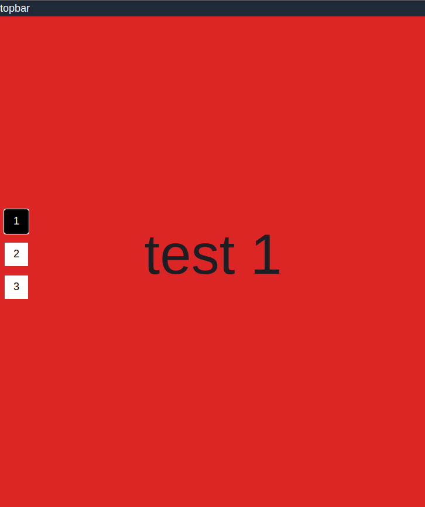
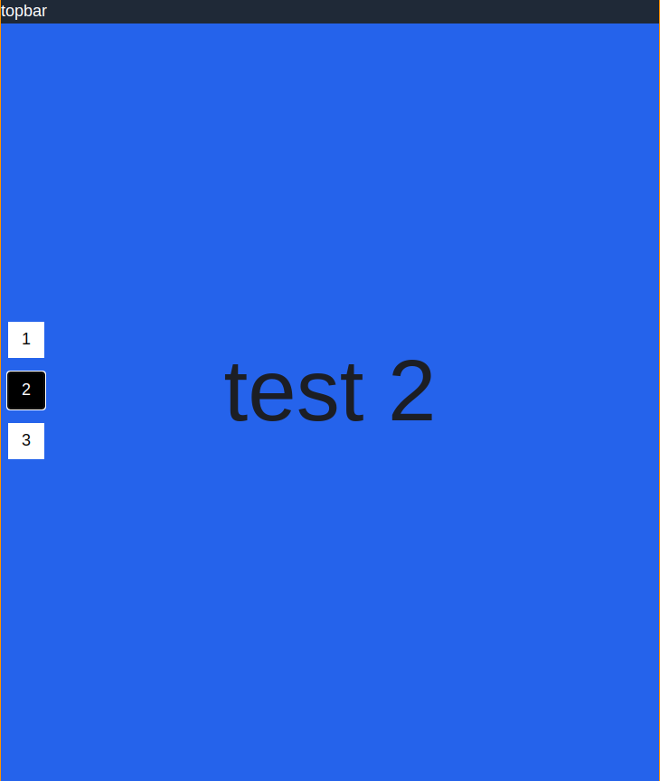

# Scroll-Snap
This is a simple example project that demonstrates snap-scroll to create a pretty cool effect.
- On scroll it will automatically snap to the next page
- On clicking the navigation buttons on the left it will scroll to the desired page
- Whenever a new page comes into view, the corresponding button is highlighted

# Installation
- Clone this repository
- Run `$ npm install` to install dependencies
- In 2 seperate terminals, execute the following commands:
  - `$ npm start` (will start the EmberJS live server)
  - `$ npx tailwindcss -i ./tailwind-input.css -o ./public/tailwind.css --watch` (will start TailwindCSS live reload)
